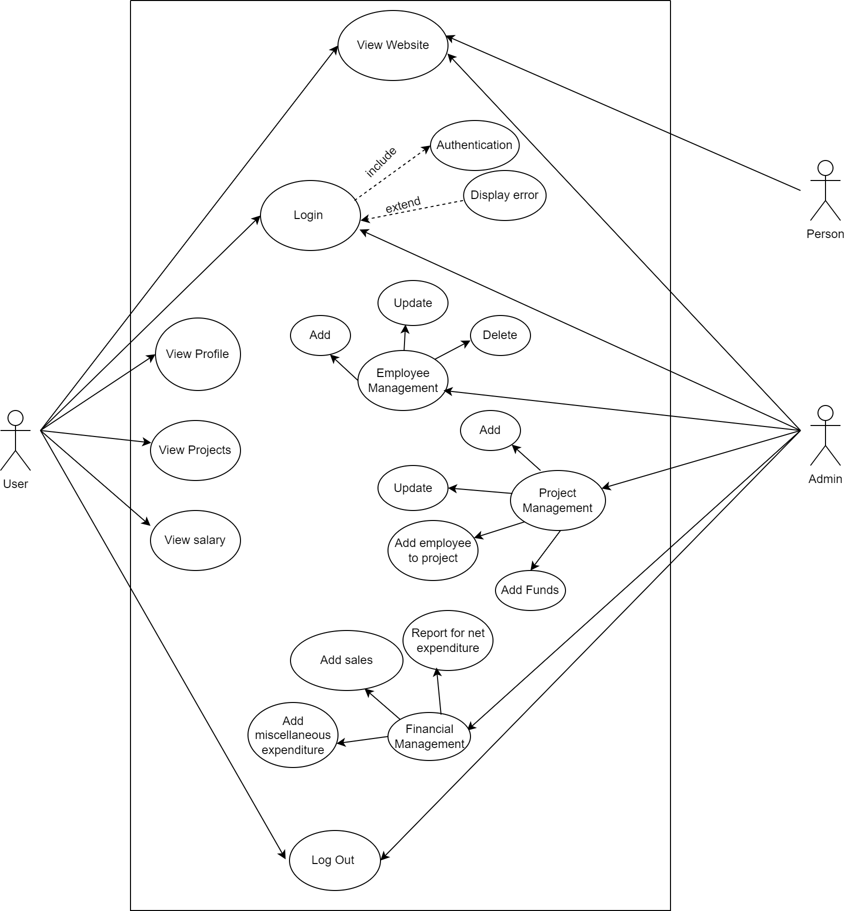

# Company Expense Management System

## Overview
The Company Expense Management System is a web application designed to streamline the management of employee details, project information, and financial data within a company. It provides two levels of authentication: employee and admin.

### Features
- **Employee Authentication**: Employees can log in to view their details and project information.
- **Admin Authentication**: Administrators have access to various functionalities categorized into different sections.
- **Data Management**: All data is stored and retrieved from a MySQL database, ensuring data integrity and scalability.
- **Security**: Authentication ensures secure access to sensitive information, with different levels of access for employees and administrators.

### Technologies Used
- **Framework**: Maven
- **Server**: Apache Tomcat v10
- **IDE**: NetBeans
- **Database**: MySQL
- **Database Connector**: MySQL Connector
- **Web Container**: Apache Tomcat v10

## Setup Instructions
1. Clone the repository from GitHub.
2. Open the project in NetBeans.
3. Set up the MySQL database using SQL Workbench.
4. Install and configure Apache Tomcat v10.
5. Add MySQL Connector to the project dependencies.
6. Update the database connection settings in the project configuration.
7. Build and deploy the application on Apache Tomcat.

## Usage
1. **Employee Login**
   - Employees can log in using their credentials to view their details and project information.
   - Salary breakdown including net salary, HRA, bonus, etc., will be displayed upon successful login.

2. **Admin Login**
   - **Employee Management**
     - **Add Employee**: Add a new employee to the system.
     - **Update Employee**: Update existing employee details.
     - **Delete Employee**: Remove an employee from the system.
   - **Project Management**
     - **Add Project**: Add a new project to the system.
     - **Update Project**: Update existing project details.
     - **Assign Employees**: Assign employees to projects.
   - **Financial Management**
     - **Add Funds**: Add funds to the company's account.
     - **Record Sales**: Record sales transactions.
     - **Miscellaneous**: Handle any other financial transactions or operations.
   - **Report Generation**
     - **Financial Report**: Generate a financial report showing the net profit or loss of the company.

## Class Diagram

## Use Case Diagram

